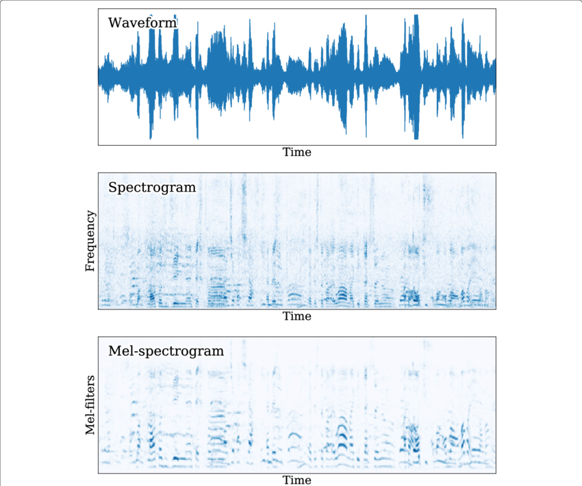

# Hàm build_dataloader 

    def build_dataloader(path_list,
                     root_path,
                     validation=False,
                     OOD_data="Data/OOD_texts.txt",
                     min_length=50,
                     batch_size=4,
                     num_workers=1,
                     device='cpu',
                     collate_config={},
                     dataset_config={}):
    dataset = FilePathDataset(path_list, root_path, OOD_data=OOD_data, min_length=min_length, validation=validation,
                              **dataset_config)
    collate_fn = Collater(**collate_config)
    data_loader = DataLoader(dataset,
                             batch_size=batch_size,
                             shuffle=(not validation),
                             num_workers=num_workers,
                             drop_last=(not validation),
                             collate_fn=collate_fn,
                             pin_memory=(device != 'cpu'))

    return data_loader

Trả về 1 đối tượng dataloader là 1 iterator lặp qua bộ dữ liệu, chạy qua 1 dataloader có nghĩa là chạy qua 1 epoch.
Các tham số :  
**path_list** : là 1 tệp .txt chuứa cấu hình là tên file|nội dung|speaker  
**root_path** : đường dẫn tới thư muc gốc chưa thư mục train và val  
**validation** : dùng để kiểm tra xem dataloader này thuộc train hay val  
**OOD_data** : Chưa rõ  
**num_workers** : Một tham số đặc trưng của Dataloader , là số luồng cpu sẽ đưa dữ liệu vào GPU  
**collate_config** : Chưa rõ  
**dataset_config** : Chưa rõ  

    dataset = FilePathDataset(path_list, root_path, OOD_data=OOD_data, min_length=min_length, validation=validation,
                              **dataset_config)

dataset là 1 đối tượng FilePathDataset  
## Class FilePathDataset là truyền nhân của Dataset có tác dụng đọc dữ liệu để load vào Dataloader

    class FilePathDataset(torch.utils.data.Dataset):
    def __init__(self,
                 data_list,
                 root_path,
                 sr=24000,
                 data_augmentation=False,
                 validation=False,
                 OOD_data="Data/OOD_texts.txt",
                 min_length=50,
                 ):

        spect_params = SPECT_PARAMS
        mel_params = MEL_PARAMS

        _data_list = [l.strip().split('|') for l in data_list]
        self.data_list = [data if len(data) == 3 else (*data, 0) for data in _data_list]
        self.text_cleaner = TextCleaner()
        self.sr = sr

        self.df = pd.DataFrame(self.data_list)

        self.to_melspec = torchaudio.transforms.MelSpectrogram(**MEL_PARAMS)

        self.mean, self.std = -4, 4
        self.data_augmentation = data_augmentation and (not validation)
        self.max_mel_length = 192
        
        self.min_length = min_length
        with open(OOD_data, 'r', encoding='utf-8') as f:
            tl = f.readlines()
        idx = 1 if '.wav' in tl[0].split('|')[0] else 0
        self.ptexts = [t.split('|')[idx] for t in tl]
        
        self.root_path = root_path

    def __len__(self):
        return len(self.data_list)

    def __getitem__(self, idx):        
        data = self.data_list[idx]
        path = data[0]
        
        wave, text_tensor, speaker_id = self._load_tensor(data)
        
        mel_tensor = preprocess(wave).squeeze()
        
        acoustic_feature = mel_tensor.squeeze()
        length_feature = acoustic_feature.size(1)
        acoustic_feature = acoustic_feature[:, :(length_feature - length_feature % 2)]
        
        # get reference sample
        ref_data = (self.df[self.df[2] == str(speaker_id)]).sample(n=1).iloc[0].tolist()
        ref_mel_tensor, ref_label = self._load_data(ref_data[:3])
        
        # get OOD text
        
        ps = ""
        
        while len(ps) < self.min_length:
            rand_idx = np.random.randint(0, len(self.ptexts) - 1)
            ps = self.ptexts[rand_idx]
            
            text = self.text_cleaner(ps)
            text.insert(0, 0)
            text.append(0)

            ref_text = torch.LongTensor(text)
        
        return speaker_id, acoustic_feature, text_tensor, ref_text, ref_mel_tensor, ref_label, path, wave

    def _load_tensor(self, data):
        wave_path, text, speaker_id = data
        speaker_id = int(speaker_id)
        wave, sr = sf.read(osp.join(self.root_path, wave_path))
        if wave.shape[-1] == 2:
            wave = wave[:, 0].squeeze()
        if sr != 24000:
            wave = librosa.resample(wave, orig_sr=sr, target_sr=24000)
            print(wave_path, sr)
            
        wave = np.concatenate([np.zeros([5000]), wave, np.zeros([5000])], axis=0)
        
        text = self.text_cleaner(text)
        
        text.insert(0, 0)
        text.append(0)
        
        text = torch.LongTensor(text)

        return wave, text, speaker_id

    def _load_data(self, data):
        wave, text_tensor, speaker_id = self._load_tensor(data)
        mel_tensor = preprocess(wave).squeeze()

        mel_length = mel_tensor.size(1)
        if mel_length > self.max_mel_length:
            random_start = np.random.randint(0, mel_length - self.max_mel_length)
            mel_tensor = mel_tensor[:, random_start:random_start + self.max_mel_length]

        return mel_tensor, speaker_id

Một số tham số quan trọng trong class FilePathDataset

    spect_params = SPECT_PARAMS
    mel_params = MEL_PARAMS
    ##
    SPECT_PARAMS = {
    "n_fft": 2048,
    "win_length": 1200,
    "hop_length": 300
    }
    MEL_PARAMS = {
        "n_mels": 80,
    }
  

Biểu đồ quang phổ Mel có hai thay đổi quan trọng so với biểu đồ quang phổ thông thường biểu diễn Tần số theo Thời gian.  
Nó sử dụng thang đo Mel thay vì tần số trên trục y.  
Nó sử dụng thang đo Decibel thay vì biên độ để chỉ màu sắc.  
Sẽ giải thích rõ hơn ở phần sau 

    _data_list = [l.strip().split('|') for l in data_list]

**_data_list** là danh sách tất cả các dòng của data  
1 record sẽ có dạng như sau : LJ001-0110.wav|ˈiːvən ðə kˈæslɑːn tˈaɪp wɛn ɛnlˈɑːɹdʒd ʃˈoʊz ɡɹˈeɪt ʃˈɔːɹtkʌmɪŋz ɪn ðɪs ɹᵻspˈɛkt :|0  

    self.data_list = [data if len(data) == 3 else (*data, 0) for data in _data_list]

self.data_list sẽ có mỗi phần tử là 1 dòng của _data_list nếu như đủ 3 thành phần là tên file, transcript, speaker. Nếu không phải thì sẽ mặc định người nói audio đó là "0".  
Cái này có thể dùng để tránh 1 số lỗi.  

    self.text_cleaner = TextCleaner()

Là 1 đối tượng TextCleaner.  
Class TextCleaner
    
    _pad = "$"
    _punctuation = ';:,.!?¡¿—…"«»“” '
    _letters = 'ABCDEFGHIJKLMNOPQRSTUVWXYZabcdefghijklmnopqrstuvwxyz'
    _letters_ipa = "ɑɐɒæɓʙβɔɕçɗɖðʤəɘɚɛɜɝɞɟʄɡɠɢʛɦɧħɥʜɨɪʝɭɬɫɮʟɱɯɰŋɳɲɴøɵɸθœɶʘɹɺɾɻʀʁɽʂʃʈʧʉʊʋⱱʌɣɤʍχʎʏʑʐʒʔʡʕʢǀǁǂǃˈˌːˑʼʴʰʱʲʷˠˤ˞↓↑→↗↘'̩'ᵻ"
    
    # Export all symbols:
    symbols = [_pad] + list(_punctuation) + list(_letters) + list(_letters_ipa)
    
    dicts = {}
    for i in range(len((symbols))):
        dicts[symbols[i]] = i

    class TextCleaner:
        def __init__(self, dummy=None):
            self.word_index_dictionary = dicts
        def __call__(self, text):
            indexes = []
            for char in text:
                try:
                    indexes.append(self.word_index_dictionary[char])
                except KeyError:
                    print(text)
            return indexes

**dicts** : là một dictionary chứa tất cả các symbols, với key là symbol và index (0,1,2,3,...) là value  
**symbols** : là tất cả các kí tự biểu diễn âm vị  
Khi đối tượng TextCleaner được gọi thì nó sẽ biến đổi 1 chuỗi symbol thành 1 dãy số tương ứng với symbol của chúng

    self.df = pd.DataFrame(self.data_list)

self.df là bản dữ liệu pandas của data_list

    self.to_melspec = torchaudio.transforms.MelSpectrogram(**MEL_PARAMS)

biến đỗi dữ liệu từ waveform thành mel spectrogram  
đầu tiên chúng ta sẽ quan tâm đến là chuyển đổi waveform (dãy tín hiệu âm thanh) thành spectrogram:  
Ta có các tham số sau 
    
    SPECT_PARAMS = {
    "n_fft": 2048,
    "win_length": 1200,
    "hop_length": 300
    }
n_fft là dài của 1 khung biến đổi fft  
win_length là độ dài của cửa sổ hann dùng để lọc tạo ra phổ  
hop_length là bước nhảy của một cửa sổ trong n_fft  
VD tôi có 1 audio dài như sau  

    audio = [1,2,3,4,5,6,7,8,9,0,2,4,6,7,3,1]  (đây là dạng waveform)
    n_fft = 10
    win_length = 4
    hop_length = 2 
    Lấy fft đầu tiên để biến đổi
    first_fft = audio[:n_fft] = audio[0:10] = [1,2,3,4,5,6,7,8,9,0]
    # lấy từng khung để biến đổi thành spectogram sẽ có độ dài mỗi khung là win_length
    win1 = [1,2,3,4]  do hop_length =2 nên nó sẽ nhảy thêm 2 bước nữa và ta sẽ có
    win2 = [3,4,5,6] ...
    win3 = [5,6,7,8] ...
    win4 = [7,8,9,0] 
    Kết thúc

Với các cửa sổ win như v ta có thể biến đổi chúng thành biểu đồ phổ với cường độ và dB (được hiển thị duoới dạng màu sắc đậm nhạt) còn tần số fft là trục y
Tiếp theo là Mel_spectrogram 
Tương tự như biểu đồ Spectrogram nhưng chỉ thay  đổi giá trị của tần số 1 xíu theo công thức như sau
    
    m=2595×log10(1 + (f/700))
Tại sao phải biến đổi như vậy. Vì nghiên cứu cho thấy con người rất dễ phân biêt các âm thanh có tần số thấp với nhau, nhưng khó có thể phân biệt chính xác các tần số cao .  
VD : Con người có thể thấy sự thay đổi rõ rệt âm thanh của 20 HZ và 220 HZ nhưng khó có thể phân biệt được âm thanh 10000HZ và 10200HZ, mặc dù chúng chỉ đều cách nhau 200 HZ.  
Chúng ta có thể thấy hàm đã sử dụng log10, để tăng cường các giá trị nhỏ và giảm ảnh hưởng của những giá trị lớn.  

    self.mean, self.std = -4, 4

Biến đổi dữ liệu, lấy giá trị trung bình là -4 và độ lệch chuẩn là 4  
VD x=[−8,−8,−8,−8,−8,0,0,0,0,0]

    self.data_augmentation = data_augmentation and (not validation)

**self.data_augmentation** Có sử dụng tăng cường dữ liệu hay không, không đối với tập val  

    self.max_mel_length = 192

**self.max_mel_length** : Chưa rõ dùng để làm gì.  

    with open(OOD_data, 'r', encoding='utf-8') as f:
        tl = f.readlines()
        idx = 1 if '.wav' in tl[0].split('|')[0] else 0
    self.ptexts = [t.split('|')[idx] for t in tl]

Lọc những file wav trong OOD file (giống như dữ liệu test) để kiểm thử.  

Hàm quan trọng __getitem__():

    def __getitem__(self, idx):
        data = self.data_list[idx]
        path = data[0]

        wave, text_tensor, speaker_id = self._load_tensor(data)

        mel_tensor = preprocess(wave).squeeze()

        acoustic_feature = mel_tensor.squeeze()
        length_feature = acoustic_feature.size(1)
        acoustic_feature = acoustic_feature[:, :(length_feature - length_feature % 2)]

        # get reference sample
        ref_data = (self.df[self.df[2] == str(speaker_id)]).sample(n=1).iloc[0].tolist()
        ref_mel_tensor, ref_label = self._load_data(ref_data[:3])

        # get OOD text

        ps = ""

        while len(ps) < self.min_length:
            rand_idx = np.random.randint(0, len(self.ptexts) - 1)
            ps = self.ptexts[rand_idx]

            text = self.text_cleaner(ps)
            text.insert(0, 0)
            text.append(0)

            ref_text = torch.LongTensor(text)

        return speaker_id, acoustic_feature, text_tensor, ref_text, ref_mel_tensor, ref_label, path, wave

Giải thích hàm 

    data = self.data_list[idx]
    path = data[0]
Đưa vào 1 index và sẽ lấy data chính là record của dòng đấy, lấy path là đường dẫn tới audio  

    wave, text_tensor, speaker_id = self._load_tensor(data)

    def _load_tensor(self, data):
        wave_path, text, speaker_id = data
        speaker_id = int(speaker_id)
        wave, sr = sf.read(osp.join(self.root_path, wave_path))
        if wave.shape[-1] == 2:
            wave = wave[:, 0].squeeze()
        if sr != 24000:
            wave = librosa.resample(wave, orig_sr=sr, target_sr=24000)
            print(wave_path, sr)
    
        wave = np.concatenate([np.zeros([5000]), wave, np.zeros([5000])], axis=0)
    
        text = self.text_cleaner(text)
    
        text.insert(0, 0)
        text.append(0)
    
        text = torch.LongTensor(text)
    
        return wave, text, speaker_id

Hàm **_load_tensor**  sẽ lấy được dẫn file audio và đọc nó về dạng có f = 24000 sau đó thêm padding 0 vào tương tương với kí hiệu "$"

    mel_tensor = preprocess(wave).squeeze()
    def preprocess(wave):
        wave_tensor = torch.from_numpy(wave).float()
        mel_tensor = to_mel(wave_tensor)
        mel_tensor = (torch.log(1e-5 + mel_tensor.unsqueeze(0)) - mean) / std
        return mel_tensor
**preprocess()** là 1 hàm dùng để biến đổi waveform về mel_tensor, được căn chỉnh theo mean và std
Định dạng: mel_tensor có định dạng (T, F), trong đó:  
T: Số khung thời gian, tương ứng với độ dài của tín hiệu âm thanh khi được phân chia thành các cửa sổ thời gian.  
F: Số bộ lọc Mel, thường là số lượng các dải tần số được biểu diễn trên thang đo Mel.  

    acoustic_feature = mel_tensor.squeeze()
    length_feature = acoustic_feature.size(1)
    acoustic_feature = acoustic_feature[:, :(length_feature - length_feature % 2)]

Dùng để lấy dữ liệu nhưng phải đảm bảo chiều tời gian size(1) phải là 1 số chẵn. acoustic_feature cuối cùng vẫn giống như là mel_tensor nhưng chiều số 1 luôn là số chẵn.  
Chưa biết dùng để làm gì  

    # get reference sample
        ref_data = (self.df[self.df[2] == str(speaker_id)]).sample(n=1).iloc[0].tolist()
        ref_mel_tensor, ref_label = self._load_data(ref_data[:3])

Lấy dữ liệu chung của 1 speaker, lấy luôn cả mel_tensor, chắc có thể dùng để tham chiếu dữ liệu chung 1 speaker cho weight

    while len(ps) < self.min_length:
        rand_idx = np.random.randint(0, len(self.ptexts) - 1)
        ps = self.ptexts[rand_idx]
    
        text = self.text_cleaner(ps)
        text.insert(0, 0)
        text.append(0)
    
        ref_text = torch.LongTensor(text)

Dùng để lấy 1 dòng dữ liệu test trong OOD sao cho dòng đó luôn có số kí tự > min_length. Trả về ref_text là 1 chuỗi số, tương ứng với các kí tự ở trong 
kho kí tự, và được thêm 2 padding ở đầu đuôi.  

Cuối cùng nó return các giá trị 

    return speaker_id, acoustic_feature, text_tensor, ref_text, ref_mel_tensor, ref_label, path, wave

**speaker_id** : id của người nói audio.  
**acoustic_feature** : 1 mel tensor luôn có chiều thời gian là 1 số chẵn [N,T].  
**text_tensor** : là 1 dãy số ứng với chuỗi kí tự data đầu vào.  
**ref_text** : Một dãy số tương tự như text tensor nhưng ở trong dữ liệu test (OOD text).  
**ref_mel_tensor** : là một mel tensor được biến đổi từ audio trong tập  validation.  
**ref_label** : Gồm 2 giá trị là text và speaker_id của audio ref_mel_tensor.  
**path** : đường dẫn tới dữ liệu train đầu tiên.  
**wave** : 1 tensor data nguyên bản của audio path.  

## Class Collater(**collate_config)

    class Collater(object):
        """
        Args:
          adaptive_batch_size (bool): if true, decrease batch size when long data comes.
        """
    
        def __init__(self, return_wave=False):
            self.text_pad_index = 0
            self.min_mel_length = 192
            self.max_mel_length = 192
            self.return_wave = return_wave
            
    
        def __call__(self, batch):
            # batch[0] = wave, mel, text, f0, speakerid
            batch_size = len(batch)
    
            # sort by mel length
            lengths = [b[1].shape[1] for b in batch]
            batch_indexes = np.argsort(lengths)[::-1]
            batch = [batch[bid] for bid in batch_indexes]
    
            nmels = batch[0][1].size(0)
            max_mel_length = max([b[1].shape[1] for b in batch])
            max_text_length = max([b[2].shape[0] for b in batch])
            max_rtext_length = max([b[3].shape[0] for b in batch])
    
            labels = torch.zeros((batch_size)).long()
            mels = torch.zeros((batch_size, nmels, max_mel_length)).float()
            texts = torch.zeros((batch_size, max_text_length)).long()
            ref_texts = torch.zeros((batch_size, max_rtext_length)).long()
    
            input_lengths = torch.zeros(batch_size).long()
            ref_lengths = torch.zeros(batch_size).long()
            output_lengths = torch.zeros(batch_size).long()
            ref_mels = torch.zeros((batch_size, nmels, self.max_mel_length)).float()
            ref_labels = torch.zeros((batch_size)).long()
            paths = ['' for _ in range(batch_size)]
            waves = [None for _ in range(batch_size)]
            
            for bid, (label, mel, text, ref_text, ref_mel, ref_label, path, wave) in enumerate(batch):
                mel_size = mel.size(1)
                text_size = text.size(0)
                rtext_size = ref_text.size(0)
                labels[bid] = label
                mels[bid, :, :mel_size] = mel
                texts[bid, :text_size] = text
                ref_texts[bid, :rtext_size] = ref_text
                input_lengths[bid] = text_size
                ref_lengths[bid] = rtext_size
                output_lengths[bid] = mel_size
                paths[bid] = path
                ref_mel_size = ref_mel.size(1)
                ref_mels[bid, :, :ref_mel_size] = ref_mel
                
                ref_labels[bid] = ref_label
                waves[bid] = wave
    
            return waves, texts, input_lengths, ref_texts, ref_lengths, mels, output_lengths, ref_mels
    
Là một class dùng để chuẩn hóa các  dữ liệu đầu vào sao cho đồng nhất cùng độ dài để cho vào batch.  

            def __init__(self, return_wave=False):
                self.text_pad_index = 0
                self.min_mel_length = 192
                self.max_mel_length = 192
                self.return_wave = return_wave

Khởi tạo những trọng số chuẩn hóa, mel_length =192, padding  = 0  

Hàm __call__

    batch_size = len(batch)
Lấy batch_size

    lengths = [b[1].shape[1] for b in batch]
    batch_indexes = np.argsort(lengths)[::-1]
    batch = [batch[bid] for bid in batch_indexes]

lengths là chỉ số thứ 1 của 1 batch chính là độ dài của 1 mel tensor (mel = [N,T], số lượng mel và thời gian)  
batch_indexes là thứ tự các hàng cũ được sắp xếp lại sao cho độ dài của mel được sắp xếp từ bé tới lớn.  
batch chính là batch mới được tạo ra từ batch cũ theo các sắp xếp độ dài của mel.  

            nmels = batch[0][1].size(0)
            max_mel_length = max([b[1].shape[1] for b in batch])
            max_text_length = max([b[2].shape[0] for b in batch])
            max_rtext_length = max([b[3].shape[0] for b in batch])

Lấy n_mels: lấy đại 1 batch (0), sau đó lấy giá trị thứ 1 của batch đó, đó chính là 1 mel, sau đó lấy size (0) tức là lấy độ cao (n_mels) của mel_tensor.  
Hiểu như sau, 1 mel tensor sẽ có 2 chiều tương ứng với 1 ma trận 2 chiều với chiều cao là tần số, n_mel =80 tức là sẽ lấy 80 giá trị tần số, chiều thứ chính là về thời gian các bước thời gian 
tại 1 điểm có tọa độ (N,T) sẽ có giá trị cường độ của âm thanh tại điểm đó, và được hiển thị theo màu sắc.  
Với những đoạn âm thanh khác nhau thì ta luôn thu được chiều T khác nhau và lớn nhất là 192 (max_mel_length). Do đó luôn cần
những công cụ để căn chỉnh dữ liệu sao cho đồng nhất để xử lí.  
**max_text_length** độ dài lớn nhất của text trong tất cả các text của batch.  
**max_rtext_length** độ dài lớn nhất của test text trong cả cá test text của batch.  

            labels = torch.zeros((batch_size)).long()
            mels = torch.zeros((batch_size, nmels, max_mel_length)).float()
            texts = torch.zeros((batch_size, max_text_length)).long()
            ref_texts = torch.zeros((batch_size, max_rtext_length)).long()

            input_lengths = torch.zeros(batch_size).long()
            ref_lengths = torch.zeros(batch_size).long()
            output_lengths = torch.zeros(batch_size).long()
            ref_mels = torch.zeros((batch_size, nmels, self.max_mel_length)).float()
            ref_labels = torch.zeros((batch_size)).long()
            paths = ['' for _ in range(batch_size)]
            waves = [None for _ in range(batch_size)]
Khởi tạo các khuôn với đệm là  0 để chuẩn bị nhét dữ liệu vào. Điều này sẽ đỡ tốn công hơn là chúng ta thêm từng đệm (0) vào mỗi tensor.  

            for bid, (label, mel, text, ref_text, ref_mel, ref_label, path, wave) in enumerate(batch):
                mel_size = mel.size(1)
                text_size = text.size(0)
                rtext_size = ref_text.size(0)
                labels[bid] = label
                mels[bid, :, :mel_size] = mel
                texts[bid, :text_size] = text
                ref_texts[bid, :rtext_size] = ref_text
                input_lengths[bid] = text_size
                ref_lengths[bid] = rtext_size
                output_lengths[bid] = mel_size
                paths[bid] = path
                ref_mel_size = ref_mel.size(1)
                ref_mels[bid, :, :ref_mel_size] = ref_mel
    
                ref_labels[bid] = ref_label
                waves[bid] = wave

Nhét dữ liệu vào các khuôn.

    return waves, texts, input_lengths, ref_texts, ref_lengths, mels, output_lengths, ref_mels

Trả về 1 batch các giá trị là :  
**waves** : tensor cường độ âm thanh.  
**texts** : tensor số của văn bản.  
**input_lengths** :  độ dài của texts.  
**ref_texts** :  tensor text trong test.  
**ref_lengths** : độ dài của tensor ref_texts.  
**mels** : tensor 2 chiều (N,T).  
**output_lengths** : T.  
**ref_mels** : tensor mel của ref_texts.

        data_loader = DataLoader(dataset,
                             batch_size=batch_size,
                             shuffle=(not validation),
                             num_workers=num_workers,
                             drop_last=(not validation),
                             collate_fn=collate_fn,
                             pin_memory=(device != 'cpu'))

Cho vào DataLoader để biến nó thành iterable để train.

    return data_loader

Trả về dataloader.
